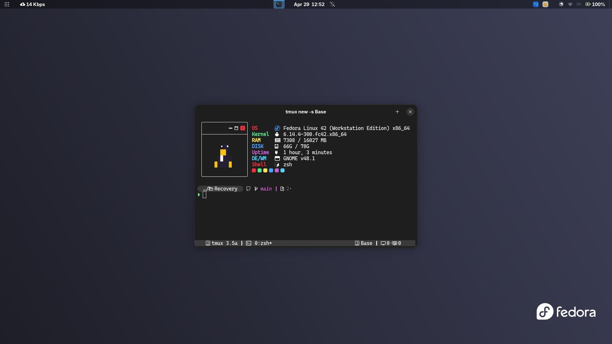

# Restore-Scripts


![oh-my-zsh](https://img.shields.io/badge/OH%20MY%20ZSH-232323?style=for-the-badge&logo=data:image/svg%2bxml;base64,PHN2ZyB4bWxucz0iaHR0cDovL3d3dy53My5vcmcvMjAwMC9zdmciIHdpZHRoPSIyNCIgaGVpZ2h0PSIyNCIgdmlld0JveD0iMCAwIDI0IDI0Ij48cGF0aCBmaWxsPSIjZmZmIiBkPSJNOS4zNjcgMi4yNWg1LjI2NmMxLjA5MiAwIDEuOTU4IDAgMi42NTUuMDU3Yy43MTQuMDU4IDEuMzE3LjE4IDEuODY5LjQ2YTQuNzUgNC43NSAwIDAgMSAyLjA3NSAyLjA3N2MuMjgxLjU1LjQwMyAxLjE1NC40NjEgMS44NjhjLjA1Ny42OTcuMDU3IDEuNTYzLjA1NyAyLjY1NXY1LjI2NmMwIDEuMDkyIDAgMS45NTgtLjA1NyAyLjY1NWMtLjA1OC43MTQtLjE4IDEuMzE3LS40NiAxLjg2OWE0Ljc1IDQuNzUgMCAwIDEtMi4wNzYgMi4wNzVjLS41NTIuMjgxLTEuMTU1LjQwMy0xLjg2OS40NjFjLS42OTcuMDU3LTEuNTYzLjA1Ny0yLjY1NS4wNTdIOS4zNjdjLTEuMDkyIDAtMS45NTggMC0yLjY1NS0uMDU3Yy0uNzE0LS4wNTgtMS4zMTctLjE4LTEuODY4LS40NmE0Ljc1IDQuNzUgMCAwIDEtMi4wNzYtMi4wNzZjLS4yODEtLjU1Mi0uNDAzLTEuMTU1LS40NjEtMS44NjljLS4wNTctLjY5Ny0uMDU3LTEuNTYzLS4wNTctMi42NTVWOS4zNjdjMC0xLjA5MiAwLTEuOTU4LjA1Ny0yLjY1NWMuMDU4LS43MTQuMTgtMS4zMTcuNDYtMS44NjhhNC43NSA0Ljc1IDAgMCAxIDIuMDc3LTIuMDc2Yy41NS0uMjgxIDEuMTU0LS40MDMgMS44NjgtLjQ2MWMuNjk3LS4wNTcgMS41NjMtLjA1NyAyLjY1NS0uMDU3TTguNTMgOC40N2EuNzUuNzUgMCAwIDAtMS4wNiAxLjA2TDkuOTQgMTJsLTIuNDcgMi40N2EuNzUuNzUgMCAxIDAgMS4wNiAxLjA2bDMtM2EuNzUuNzUgMCAwIDAgMC0xLjA2ek0xMyAxNC4yNWEuNzUuNzUgMCAwIDAgMCAxLjVoM2EuNzUuNzUgMCAwIDAgMC0xLjV6Ii8+PC9zdmc+)
![nerd fonts](https://img.shields.io/badge/nerd%20fonts-232323?style=for-the-badge&logo=data:image/svg%2bxml;base64,PHN2ZyB4bWxucz0iaHR0cDovL3d3dy53My5vcmcvMjAwMC9zdmciIHdpZHRoPSIyNCIgaGVpZ2h0PSIyNCIgdmlld0JveD0iMCAwIDI0IDI0Ij48cGF0aCBmaWxsPSIjZmZjZTNlIiBkPSJNMyAxMGMtLjI0IDAtLjQ1LjA5LS41OS4yNWMtLjE0LjE1LS4yLjM3LS4xNy42MWwuNSAyLjk5QzIuODIgMTQuNSAzLjQgMTUgNCAxNWgzYy42NCAwIDEuMzYtLjU2IDEuNS0xLjE4bDEuMDYtMy4xOWMuMDQtLjEzLjAxLS4zMi0uMDYtLjQ0Yy0uMTEtLjEyLS4yOC0uMTktLjUtLjE5em00IDdINEMyLjM4IDE3IC45NiAxNS43NC43NiAxNC4xNGwtLjUtMi45OUMuMTUgMTAuMy4zOSA5LjUuOTEgOC45MlMyLjE5IDggMyA4aDZjLjgzIDAgMS41OC4zNSAyLjA2Ljk2Yy4xMS4xNS4yMS4zMS4yOS40OWMuNDMtLjA5Ljg3LS4wOSAxLjI5IDBjLjA4LS4xOC4xOC0uMzQuMy0uNDlDMTMuNDEgOC4zNSAxNC4xNiA4IDE1IDhoNmMuODEgMCAxLjU3LjM0IDIuMDkuOTJjLjUxLjU4Ljc1IDEuMzguNjUgMi4xOWwtLjUxIDMuMDdDMjMuMDQgMTUuNzQgMjEuNjEgMTcgMjAgMTdoLTNjLTEuNTYgMC0zLjA4LTEuMTktMy40Ni0yLjdsLS45LTIuNzFjLS4zOC0uMjgtLjkxLS4yOC0xLjI5IDBsLS45MiAyLjc4QzEwLjA3IDE1LjgyIDguNTYgMTcgNyAxN204LTdjLS4yMiAwLS4zOS4wNy0uNS4xOWMtLjA4LjEyLS4xLjMxLS4wNS41MWwxLjAxIDMuMDVjLjE4LjY5LjkgMS4yNSAxLjU0IDEuMjVoM2MuNTkgMCAxLjE4LS41IDEuMjUtMS4xMWwuNTEtMy4wN2MuMDMtLjItLjAzLS40Mi0uMTctLjU3QS43Ny43NyAwIDAgMCAyMSAxMHoiLz48L3N2Zz4=)

![rxfetch](https://img.shields.io/badge/rxfetch-232323?style=for-the-badge&logo=data:image/svg%2bxml;base64,PHN2ZyB4bWxucz0iaHR0cDovL3d3dy53My5vcmcvMjAwMC9zdmciIHdpZHRoPSIyNCIgaGVpZ2h0PSIyNCIgdmlld0JveD0iMCAwIDI0IDI0Ij48cGF0aCBmaWxsPSIjZmZmIiBkPSJNOS4zNjcgMi4yNWg1LjI2NmMxLjA5MiAwIDEuOTU4IDAgMi42NTUuMDU3Yy43MTQuMDU4IDEuMzE3LjE4IDEuODY5LjQ2YTQuNzUgNC43NSAwIDAgMSAyLjA3NSAyLjA3N2MuMjgxLjU1LjQwMyAxLjE1NC40NjEgMS44NjhjLjA1Ny42OTcuMDU3IDEuNTYzLjA1NyAyLjY1NXY1LjI2NmMwIDEuMDkyIDAgMS45NTgtLjA1NyAyLjY1NWMtLjA1OC43MTQtLjE4IDEuMzE3LS40NiAxLjg2OWE0Ljc1IDQuNzUgMCAwIDEtMi4wNzYgMi4wNzVjLS41NTIuMjgxLTEuMTU1LjQwMy0xLjg2OS40NjFjLS42OTcuMDU3LTEuNTYzLjA1Ny0yLjY1NS4wNTdIOS4zNjdjLTEuMDkyIDAtMS45NTggMC0yLjY1NS0uMDU3Yy0uNzE0LS4wNTgtMS4zMTctLjE4LTEuODY4LS40NmE0Ljc1IDQuNzUgMCAwIDEtMi4wNzYtMi4wNzZjLS4yODEtLjU1Mi0uNDAzLTEuMTU1LS40NjEtMS44NjljLS4wNTctLjY5Ny0uMDU3LTEuNTYzLS4wNTctMi42NTVWOS4zNjdjMC0xLjA5MiAwLTEuOTU4LjA1Ny0yLjY1NWMuMDU4LS43MTQuMTgtMS4zMTcuNDYtMS44NjhhNC43NSA0Ljc1IDAgMCAxIDIuMDc3LTIuMDc2Yy41NS0uMjgxIDEuMTU0LS40MDMgMS44NjgtLjQ2MWMuNjk3LS4wNTcgMS41NjMtLjA1NyAyLjY1NS0uMDU3TTguNTMgOC40N2EuNzUuNzUgMCAwIDAtMS4wNiAxLjA2TDkuOTQgMTJsLTIuNDcgMi40N2EuNzUuNzUgMCAxIDAgMS4wNiAxLjA2bDMtM2EuNzUuNzUgMCAwIDAgMC0xLjA2ek0xMyAxNC4yNWEuNzUuNzUgMCAwIDAgMCAxLjVoM2EuNzUuNzUgMCAwIDAgMC0xLjV6Ii8+PC9zdmc+)


This script restores configuration files and settings for popular CLI tools on your system.



## Requirements

Make sure you have the following tools installed before running the script:

- [Oh My Zsh](https://ohmyz.sh/)
- [Nerd Fonts](https://www.nerdfonts.com/)
- [Starship](https://starship.rs/)
- [Rxfetch](https://github.com/mngshm/rxfetch)
- [Colorls](https://github.com/athityakumar/colorls)
- [Tmux](https://github.com/tmux/tmux/wiki/Installing)

> Other cli tools: `bat` `speedtest-cli` `trash` `mdv`

## Usage

### Clone and Run

```bash
git clone https://github.com/Troy8203/recovery_tools.git
cd Restore-Scripts
./main.sh [option]
```

### Options

| Option              | Description                                           |
|---------------------|-------------------------------------------------------|
| `-h`, `--help`       | Show help message                                     |
| `-v`, `--version`    | Show script version                                   |
| `-a`, `--all`        | Restore all configurations                            |
| `-o`, `--omz`        | Restore Oh My Zsh configuration (aliases, functions) |
| `-s`, `--starship`   | Restore Starship configuration                        |
| `-r`, `--rxfetch`    | Restore Rxfetch configuration                         |
| `-c`, `--colorls`    | Restore Colorls configuration                         |
| `-tm`, `--tmux`      | Restore Tmux configuration                            |
| `-t`, `--test`       | Check the current status of all tools                 |
| `-sc`, `--shortcreate` | Create user-defined shortcuts                       |
| `-sr`, `--shortrestore` | Restore user-defined shortcuts                    |


## Features

- One-command restore for terminal customization tools
- Individual restore options for each supported tool
- Shortcut creation and restoration
- System status checking for supported tools


## Others
- [🖼️ Gallery](./docs/galery.md)